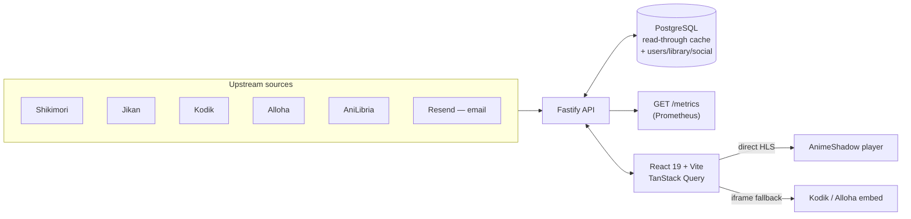
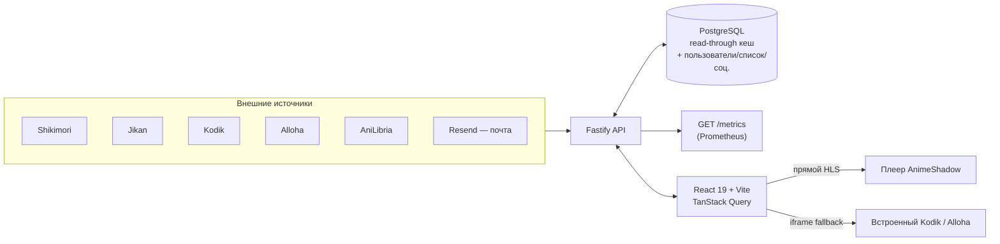

<a id="top"></a>
<div align="center">

# 影 AnimeShadow

**A screening-room catalogue for anime — discover, track, watch, discuss.**
**Каталог аниме в стиле тёмного кинозала — находи, отслеживай, смотри, обсуждай.**

[](https://www.typescriptlang.org/)
[](https://react.dev/)
[](https://fastify.dev/)
[](https://www.postgresql.org/)
[](https://www.prisma.io/)
[](https://tailwindcss.com/)
[](https://prometheus.io/)
[](https://nodejs.org/)
[](https://pnpm.io/)

**[🇬🇧 English](#-english)** · **[🇷🇺 Русский](#-русский)**

</div>

---

<a id="-english"></a>

## 🇬🇧 English

A screening-room catalogue for anime. Discover what's airing, dig into any
title, build a personal watch list, and watch it — in **AnimeShadow's own
player**, not a third-party page.

### ✨ Features

- **Catalogue** — Shikimori (primary) + Jikan (fallback) as a read-through
  Postgres cache. Titles/synopses localise Russian↔English: Shikimori's
  human-written text first, then keyless machine translation (Google →
  MyMemory) as a fallback, cached forever.
- **Smart search** — one query, four lenses in parallel: title, character
  name, mood/vibe ("sad space anime" → Drama + Space), and synopsis text.
  Merged, de-duplicated, ranked.
- **Its own video player** — when a title has a direct stream (AniLibria's
  HLS API), AnimeShadow renders it in a fully custom `<video>` player: seek
  bar with a buffered-range indicator, volume, playback speed, quality
  selector (from the HLS manifest), Picture-in-Picture, ±10s skip, full
  keyboard shortcuts (`Space`/`K` play, `←`/`→` seek, `↑`/`↓` volume, `M`
  mute, `F` fullscreen, `P` PiP), an auto-advancing "next episode" card, and
  resume-from-last-position. Titles without a direct stream fall back to an
  embedded player (Kodik, with Alloha as a secondary aggregator) — a
  same-page toggle lets a viewer switch between "AnimeShadow player" and the
  embed explicitly. *(A third-party iframe's internal UI can't be
  restyled or replaced by any site — that's the browser's same-origin
  policy, not a limitation of this app.)*
- **Personal library** — watch status, your own score, episode progress.
- **Reviews & comments** — one rating+review per user per title (editable,
  never duplicated); threaded comments with public/anonymous/supporter-only
  modes and voting.
- **Achievements** — a holographic-foil badge system with rarity tiers, up
  to 3 pinned under your name.
- **Recommendations** — a lightweight engine from your library + explicit
  genre/title picks.
- **Auth** — email/password with a 6-digit **email verification code** and
  **"forgot password" reset flow** (via [Resend](https://resend.com), branded
  HTML email templates, codes stored only as salted hashes, rate-limited,
  attempt-capped) — plus one-tap **Sign in with Telegram**.
- **Admin panel** — traffic/audience dashboard, user management, comment and
  review moderation, all gated behind a DB-checked `ADMIN` role (never a JWT
  claim alone).
- **Observability** — a `/metrics` endpoint in Prometheus exposition format:
  HTTP latency/throughput per route, plus product counters (signups, logins,
  emails sent, total watch-seconds) — all bumped as in-memory counters on
  requests that were happening anyway, so metrics collection **never adds a
  database query**.

### 🏗️ Architecture



### 🧱 Stack

| Layer | Choice | Why |
| --- | --- | --- |
| Language | TypeScript (strict, ESM) everywhere | one type system across the wire |
| Database | PostgreSQL 16 (Docker) | users, library, social, cached catalogue |
| ORM | Prisma 6 | typed queries, migrations |
| API | Fastify 5 | fast, first-class TS, plugin encapsulation |
| Validation | Zod (`@animeshadow/shared`) | one contract for the API boundary **and** frontend forms |
| Auth | `@fastify/jwt` + bcrypt + Telegram Login Widget | stateless bearer tokens, one-tap OAuth-style sign-in |
| Email | [Resend](https://resend.com) | verification codes, password resets |
| Frontend | React 19 + Vite 6 | fast dev server, native ESM, route-level code splitting |
| Data fetching | TanStack Query 5 | request dedup, caching, background refetch |
| UI | shadcn/ui (Radix) + Tailwind CSS v4 | composable primitives, semantic tokens |
| Routing | React Router 7 (data router, lazy routes) | |
| Video | `hls.js` | direct HLS playback in AnimeShadow's own player |
| Search | `fuse.js` | fuzzy-match highlighting in the search combobox |
| Metrics | `prom-client` | Prometheus exposition at `GET /metrics` |
| Metadata | Shikimori (primary) → Jikan (fallback) | anime data, RU-first |
| Player sources | `kodikwrapper` (Kodik) · Alloha · AniLibria (direct HLS) | |

### 📂 Repository layout

```
apps/
  api/        Fastify server — routes, services, plugins
  web/        Vite + React SPA
packages/
  shared/     Zod schemas + inferred types for every API contract
  db/         Prisma schema, client, catalogue read/write helpers
  jikan/      Rate-limited Jikan client
  shikimori/  Shikimori client (primary metadata source)
  kodik/      Kodik client — embed player sources
  alloha/     Alloha client — secondary embed aggregator
deploy/       Caddyfile + systemd unit for a real deployment
docker-compose.yml   Postgres 16 on host port 5433
```

### 🚀 Quick start

```bash
# 1. Configuration
cp .env.example .env          # defaults work as-is for local dev

# 2. One-time setup: install, start Postgres, migrate, seed the catalogue
pnpm install
pnpm setup
#   └─ pnpm db:up && pnpm db:generate && pnpm packages:build && pnpm db:migrate && pnpm db:seed

# 3. Run API + web together
pnpm dev
```

- Web: <http://localhost:5173> (Vite picks the next free port if taken)
- API: <http://localhost:4000/api> (proxied through Vite in dev — no CORS setup needed)

Everything works out of the box with empty optional keys: no `RESEND_API_KEY`
means verification/reset codes are printed to the API console instead of
emailed; no `KODIK_API_TOKEN`/Telegram bot token just disables that one
feature. See `.env.example` for every variable, with inline explanations.

### 📜 Scripts

| Command | Effect |
| --- | --- |
| `pnpm dev` | API + web with hot reload |
| `pnpm build` | build every package and app |
| `pnpm typecheck` | `tsc --noEmit` across the workspace |
| `pnpm lint` / `pnpm format` | ESLint / Prettier |
| `pnpm db:up` / `pnpm db:down` | start / stop the Postgres container |
| `pnpm db:migrate` | create & apply a migration |
| `pnpm db:seed` | fill the catalogue from Shikimori/Jikan (idempotent) |
| `pnpm db:studio` | open Prisma Studio |
| `pnpm db:grant-pro` | grant PRO to an account by email |

### 🔌 API surface

Grouped by area — every route validates its input with a Zod schema from
`@animeshadow/shared` and returns `{ "error": { "code", "message", "fields"? } }`
on failure.

| Area | Routes |
| --- | --- |
| Catalogue | `GET /api/discover`, `/api/anime`, `/api/anime/:id`, `/api/search`, `/api/genres` |
| Watch | `GET /api/anime/:id/watch` — ranked player sources (direct HLS + embeds) |
| Auth | `POST /api/auth/{register,login,telegram}`, `GET /api/auth/me` |
| Email verification | `POST /api/auth/{verify-email,resend-verification}` |
| Password reset | `POST /api/auth/{forgot-password,reset-password}` |
| Library | `GET/PUT/DELETE /api/library/:animeId`, `GET /api/library/summary` |
| Reviews | `GET/PUT/DELETE /api/anime/:id/reviews` |
| Comments | `GET/POST/PATCH/DELETE /api/comments`, `POST /api/comments/:id/vote` |
| Profile | `GET/PATCH /api/me/profile`, achievements, avatar upload |
| Recommendations | `GET /api/recommendations/*` |
| Admin (role-gated) | `/api/admin/{overview,users,comments,reviews}` |
| Ops | `GET /api/health`, `GET /metrics` (Prometheus, optionally token-gated) |

### 🔒 Security notes

- Every route validates input with Zod; unknown fields are silently dropped
  (no mass-assignment surface).
- Passwords: bcrypt, cost 12. Verification/reset codes: SHA-256 hashed at
  rest, 15-minute expiry, capped wrong-attempts, single-use.
- `requireAdmin` re-checks the caller's role from the database on every
  request — a demoted admin loses access on their very next call, not
  whenever their token happens to expire.
- The `/api/img` proxy enforces an explicit host allow-list + `https:` only
  (no open SSRF pivot). Avatar path serving is regex + path-normalisation
  guarded against traversal.
- `POST /auth/forgot-password` always returns `204` whether or not the email
  is registered — no account-enumeration oracle.

### 🚢 Production build

```bash
pnpm build
pnpm --filter @animeshadow/db migrate:deploy   # against the real DATABASE_URL
node apps/api/dist/server.js                    # serve the API
# serve apps/web/dist as static files; set VITE_API_URL before building web
```

`deploy/` has a working reference: a `Caddyfile` (reverse-proxies `/api` and
`/uploads` to the Fastify process, serves the built SPA otherwise) and a
`systemd` unit for the API process. `deploy/setup.sh` / `deploy/deploy.sh`
walk through provisioning a fresh host.

### 📝 Notes

- Shikimori/Jikan are community APIs and occasionally rate-limit or `504`
  under load; the app degrades to cached data instead of erroring.
- AnimeShadow never hosts video — every stream is resolved from a
  third-party provider (AniLibria direct, or Kodik/Alloha embeds) at watch
  time. See the in-app disclaimer in the footer.
- Postgres is published on host port **5433** to avoid clashing with a local
  install on 5432 — change `POSTGRES_PORT` in `.env` if you like.

---

<div align="center">

[⬆ Back to top](#top) · [Русский ⬇](#-русский)

</div>

---

<a id="-русский"></a>

## 🇷🇺 Русский

Каталог аниме в стиле тёмного кинозала. Узнавайте, что сейчас выходит,
изучайте любой тайтл, ведите личный список — и смотрите его **в собственном
плеере AnimeShadow**, а не на стороннем сайте.

### ✨ Возможности

- **Каталог** — Shikimori (основной источник) + Jikan (резервный) как
  read-through кеш в Postgres. Названия и описания локализуются RU↔EN:
  сначала человеческий текст Shikimori, затем бесключевой машинный перевод
  (Google → MyMemory) как fallback — результат кешируется навсегда.
- **Умный поиск** — один запрос сразу через четыре «линзы» параллельно:
  название, имя персонажа, настроение/вайб («грустное аниме про космос» →
  Драма + Космос) и текст описания. Результаты объединяются, дедуплицируются
  и ранжируются.
- **Собственный видео-плеер** — если у тайтла есть прямой поток (HLS от
  AniLibria), AnimeShadow показывает его в полностью своём `<video>`-плеере:
  шкала перемотки с индикатором буфера, громкость, скорость воспроизведения,
  выбор качества (прямо из HLS-манифеста), Picture-in-Picture, перемотка
  ±10 сек, полный набор горячих клавиш (`Space`/`K` — пауза, `←`/`→` —
  перемотка, `↑`/`↓` — громкость, `M` — звук, `F` — полный экран, `P` —
  PiP), карточка автоперехода на следующую серию, возобновление с
  последней позиции. Тайтлы без прямого потока используют встроенный плеер
  (Kodik, Alloha как вторичный агрегатор) — рядом есть переключатель между
  «плеером AnimeShadow» и встроенным плеером. *(Перекрасить или заменить
  внутренний интерфейс чужого iframe не может ни один сайт в мире — это
  политика same-origin браузера, а не ограничение этого приложения.)*
- **Личный список** — статус просмотра, своя оценка, прогресс по эпизодам.
- **Отзывы и комментарии** — один рейтинг+отзыв на пользователя на тайтл
  (редактируется, никогда не дублируется); комментарии с ветками ответов,
  режимами публичный/анонимный/только для доноров и голосованием.
- **Достижения** — система голографических значков с уровнями редкости, до
  3 закреплённых под именем.
- **Рекомендации** — лёгкий движок на основе списка и явно выбранных
  жанров/тайтлов.
- **Авторизация** — email/пароль с **6-значным кодом подтверждения почты** и
  восстановлением пароля через **код из письма** (на
  [Resend](https://resend.com), брендированные HTML-письма, коды хранятся
  только как хеш, с лимитом попыток и защитой от спама) — плюс вход в один
  клик через **Telegram**.
- **Админ-панель** — дашборд трафика и аудитории, управление пользователями,
  модерация комментариев и отзывов — доступ проверяется по роли `ADMIN`
  прямо в БД на каждый запрос, а не по данным из токена.
- **Наблюдаемость** — эндпоинт `/metrics` в формате Prometheus: задержки и
  количество запросов по каждому роуту, плюс продуктовые счётчики
  (регистрации, входы, отправленные письма, секунды просмотра) — всё
  инкрементируется в памяти на уже происходящих запросах, так что сбор
  метрик **никогда не добавляет запросов к базе данных**.

### 🏗️ Архитектура



### 🧱 Технологии

| Слой | Выбор | Почему |
| --- | --- | --- |
| Язык | TypeScript (strict, ESM) везде | единая система типов на всех уровнях |
| БД | PostgreSQL 16 (Docker) | пользователи, список, соц. функции, кеш каталога |
| ORM | Prisma 6 | типизированные запросы, миграции |
| API | Fastify 5 | быстрый, TS из коробки, инкапсуляция через плагины |
| Валидация | Zod (`@animeshadow/shared`) | один контракт для API-границы **и** форм на фронте |
| Авторизация | `@fastify/jwt` + bcrypt + Telegram Login Widget | stateless bearer-токены + вход в один клик |
| Почта | [Resend](https://resend.com) | коды подтверждения, сброс пароля |
| Фронтенд | React 19 + Vite 6 | быстрый dev-сервер, нативный ESM, code-splitting по роутам |
| Данные | TanStack Query 5 | дедупликация запросов, кеш, фоновый рефетч |
| UI | shadcn/ui (Radix) + Tailwind CSS v4 | компонуемые примитивы, семантические токены |
| Роутинг | React Router 7 (data router, ленивые роуты) | |
| Видео | `hls.js` | прямое воспроизведение HLS в своём плеере |
| Поиск | `fuse.js` | подсветка нечёткого совпадения в поиске |
| Метрики | `prom-client` | экспозиция Prometheus на `GET /metrics` |
| Метаданные | Shikimori (основной) → Jikan (резерв) | данные об аниме, RU-first |
| Источники плеера | `kodikwrapper` (Kodik) · Alloha · AniLibria (прямой HLS) | |

### 📂 Структура репозитория

```
apps/
  api/        Fastify-сервер — роуты, сервисы, плагины
  web/        Vite + React SPA
packages/
  shared/     Zod-схемы и типы для каждого контракта API
  db/         Prisma-схема, клиент, хелперы чтения/записи каталога
  jikan/      Клиент Jikan с ограничением частоты запросов
  shikimori/  Клиент Shikimori (основной источник метаданных)
  kodik/      Клиент Kodik — источники встроенного плеера
  alloha/     Клиент Alloha — вторичный агрегатор
deploy/       Caddyfile + systemd-юнит для реального деплоя
docker-compose.yml   Postgres 16 на порту хоста 5433
```

### 🚀 Быстрый старт

```bash
# 1. Конфигурация
cp .env.example .env          # значения по умолчанию подходят для локальной разработки

# 2. Разовая настройка: установка, запуск Postgres, миграции, наполнение каталога
pnpm install
pnpm setup
#   └─ pnpm db:up && pnpm db:generate && pnpm packages:build && pnpm db:migrate && pnpm db:seed

# 3. Запуск API + фронтенда вместе
pnpm dev
```

- Веб: <http://localhost:5173> (Vite сам выберет свободный порт, если занят)
- API: <http://localhost:4000/api> (проксируется через Vite в dev — CORS настраивать не нужно)

Всё работает «из коробки» с пустыми необязательными ключами: без
`RESEND_API_KEY` коды подтверждения/сброса просто печатаются в консоль API
вместо отправки письмом; без `KODIK_API_TOKEN`/токена Telegram-бота
отключается только соответствующая фича. Полный список переменных с
комментариями — в `.env.example`.

### 📜 Скрипты

| Команда | Эффект |
| --- | --- |
| `pnpm dev` | API + веб с hot reload |
| `pnpm build` | сборка всех пакетов и приложений |
| `pnpm typecheck` | `tsc --noEmit` по всему воркспейсу |
| `pnpm lint` / `pnpm format` | ESLint / Prettier |
| `pnpm db:up` / `pnpm db:down` | запустить / остановить контейнер Postgres |
| `pnpm db:migrate` | создать и применить миграцию |
| `pnpm db:seed` | наполнить каталог из Shikimori/Jikan (идемпотентно) |
| `pnpm db:studio` | открыть Prisma Studio |
| `pnpm db:grant-pro` | выдать PRO аккаунту по email |

### 🔌 API

Сгруппировано по областям — каждый роут валидирует вход через Zod-схему из
`@animeshadow/shared` и при ошибке возвращает
`{ "error": { "code", "message", "fields"? } }`.

| Область | Роуты |
| --- | --- |
| Каталог | `GET /api/discover`, `/api/anime`, `/api/anime/:id`, `/api/search`, `/api/genres` |
| Просмотр | `GET /api/anime/:id/watch` — источники плеера, ранжированные (прямой HLS + встроенные) |
| Авторизация | `POST /api/auth/{register,login,telegram}`, `GET /api/auth/me` |
| Подтверждение почты | `POST /api/auth/{verify-email,resend-verification}` |
| Сброс пароля | `POST /api/auth/{forgot-password,reset-password}` |
| Список | `GET/PUT/DELETE /api/library/:animeId`, `GET /api/library/summary` |
| Отзывы | `GET/PUT/DELETE /api/anime/:id/reviews` |
| Комментарии | `GET/POST/PATCH/DELETE /api/comments`, `POST /api/comments/:id/vote` |
| Профиль | `GET/PATCH /api/me/profile`, достижения, загрузка аватара |
| Рекомендации | `GET /api/recommendations/*` |
| Админка (по роли) | `/api/admin/{overview,users,comments,reviews}` |
| Служебное | `GET /api/health`, `GET /metrics` (Prometheus, опционально за токеном) |

### 🔒 О безопасности

- Каждый роут валидирует вход через Zod; неизвестные поля молча
  отбрасываются (нет поверхности для mass-assignment).
- Пароли — bcrypt, cost 12. Коды подтверждения/сброса — хешируются SHA-256
  перед сохранением, живут 15 минут, ограничены по числу попыток,
  одноразовые.
- `requireAdmin` перепроверяет роль вызывающего прямо в базе на каждый
  запрос — разжалованный админ теряет доступ со следующего же запроса, а не
  когда истечёт токен.
- Прокси `/api/img` использует явный allow-list хостов + только `https:`
  (нет открытого SSRF). Отдача аватаров защищена regex + нормализацией пути
  от traversal-атак.
- `POST /auth/forgot-password` всегда отвечает `204` независимо от того,
  зарегистрирована почта или нет — невозможно перечислить существующие
  аккаунты через этот эндпоинт.

### 🚢 Продакшн-сборка

```bash
pnpm build
pnpm --filter @animeshadow/db migrate:deploy   # на реальный DATABASE_URL
node apps/api/dist/server.js                    # запуск API
# apps/web/dist раздаётся статикой; VITE_API_URL задать перед сборкой веба
```

В `deploy/` — рабочий референс: `Caddyfile` (проксирует `/api` и `/uploads`
на процесс Fastify, остальное отдаёт как собранный SPA) и `systemd`-юнит для
процесса API. `deploy/setup.sh` / `deploy/deploy.sh` проводят через настройку
чистого сервера.

### 📝 Заметки

- Shikimori/Jikan — открытые community-API, иногда ограничивают частоту
  запросов или отвечают `504` под нагрузкой; приложение в этом случае
  показывает кешированные данные вместо ошибки.
- AnimeShadow никогда не хранит видео сам — каждый поток разрешается через
  стороннего провайдера в момент просмотра (AniLibria напрямую, либо
  встроенные Kodik/Alloha). См. дисклеймер в подвале сайта.
- Postgres опубликован на порту хоста **5433**, чтобы не конфликтовать с
  локальной установкой на 5432 — при желании смените `POSTGRES_PORT` в
  `.env`.

---

<div align="center">

[⬆ Наверх](#top) · [English ⬆](#-english)

</div>
